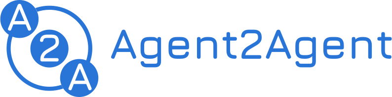
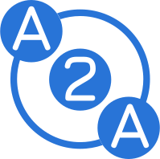
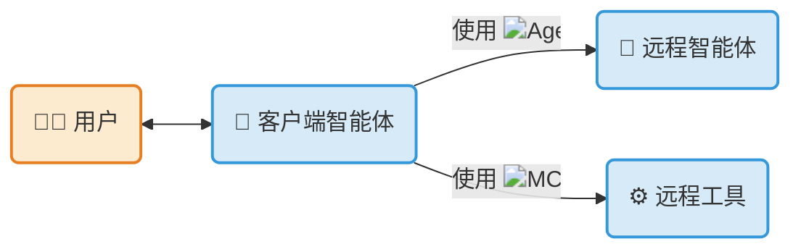

---
hide:
  - toc
  - navigation
---

<!-- markdownlint-disable MD041 -->

  

    <h1></h1>
  

  
一种开放协议，实现不透明智能体应用之间的通信和互操作性。

  [开始使用](./tutorials/python/1-introduction.md){ .md-button .md-button--primary }
  [阅读规范](./specification.md){ .md-button }

## 什么是 A2A 协议？

**Agent2Agent（A2A）协议**是一种开放标准，用于 AI 智能体之间的无缝通信和协作。在智能体使用不同框架、由不同供应商构建的世界中，A2A 提供了智能体互操作性的通用语言。

!!! abstract ""
    使用 **[{class="twemoji lg middle"} ADK](https://google.github.io/adk-docs/)**（或任何框架）构建，
    配备 **[{class="twemoji lg middle"} MCP](https://modelcontextprotocol.io)**（或任何工具），
    并通过 **{class="twemoji lg middle"} A2A**
    与远程智能体、本地智能体和人类通信。

## 主要特性

- :material-account-group-outline:{ .lg .middle } **互操作性**

    连接基于不同平台（LangGraph、CrewAI、Semantic Kernel、自定义解决方案）构建的智能体，创建强大的复合 AI 系统。

- :material-lan-connect:{ .lg .middle } **复杂工作流**

    使智能体能够委派子任务、交换信息并协调行动，解决单个智能体无法解决的复杂问题。

- :material-shield-key-outline:{ .lg .middle } **安全且不透明**

    智能体无需共享内部记忆、工具或专有逻辑即可交互，确保安全性并保护知识产权。

- :material-puzzle-outline:{ .lg .middle } **可扩展**

    通过正式的协议[扩展和自定义绑定](./topics/extension-and-binding-governance.md)添加功能，由分层推进流程治理，确保核心保持稳定。

## 开始使用 A2A

- :material-book-open:{ .lg .middle } **阅读介绍**

    理解 A2A 背后的核心思想。

    [:octicons-arrow-right-24: 什么是 A2A？](./topics/what-is-a2a.md)

    [:octicons-arrow-right-24: 核心概念](./topics/key-concepts.md)

- :material-file-document-outline:{ .lg .middle } **深入规范**

    探索 A2A 协议的详细技术定义。

    [:octicons-arrow-right-24: 协议规范](./specification.md)

- :material-application-cog-outline:{ .lg .middle } **跟随教程**

    通过我们的分步 Python 快速入门指南构建您的第一个 A2A 兼容智能体。

    [:octicons-arrow-right-24: 实践教程](./tutorials/python/1-introduction.md)

- :material-code-braces:{ .lg .middle } **探索代码示例**

    通过示例客户端、服务器和智能体框架集成，查看 A2A 的实际应用。

    [:fontawesome-brands-github: GitHub 示例](https://github.com/a2aproject/a2a-samples)

- :material-code-braces:{ .lg .middle } **下载官方 SDK**

    [:fontawesome-brands-python: Python](https://github.com/a2aproject/a2a-python)

    [:fontawesome-brands-js: JavaScript](https://github.com/a2aproject/a2a-js)

    [:fontawesome-brands-java: Java](https://github.com/a2aproject/a2a-java)

    [:material-language-csharp: C#/.NET](https://github.com/a2aproject/a2a-dotnet)

    [:fontawesome-brands-golang: Golang](https://github.com/a2aproject/a2a-go)

    [:fontawesome-brands-rust: Rust](https://github.com/a2aproject/a2a-rust)

- :material-play-circle:{ .lg .middle } **视频** 8 分钟以内介绍

    <iframe class="video-container" src="https://www.youtube.com/embed/Fbr_Solax1w?si=QxPMEEiO5kLr5_0F" title="YouTube 视频播放器" frameborder="0" allow="accelerometer; autoplay; clipboard-write; encrypted-media; gyroscope; picture-in-picture; web-share" referrerpolicy="strict-origin-when-cross-origin" allowfullscreen></iframe>

- :material-play-circle:{ .lg .middle } **课程** [DeepLearning.AI](https://deeplearning.ai) - A2A 入门

    

## A2A 如何与 MCP 协同工作

模型上下文协议（MCP）和 A2A 协议并非竞争者——它们是高度互补的。它们解决两个不同的问题，并设计为协同工作。

- **MCP 用于智能体与工具通信：** 它标准化了智能体如何连接到其工具、API 和资源以获取信息。参见[模型上下文协议](https://modelcontextprotocol.io/)。
- **A2A 用于智能体间通信：** 作为一种通用的去中心化标准，A2A 让独立的智能体（包括使用 MCP 的智能体）能够互相发现、委派任务并共享结果。

使用 MCP 为单个智能体配备其工作所需的特定工具（例如，访问 GitHub 仓库或 SQL 数据库）。使用 A2A 让该专业智能体能够跨不同框架与其他智能体安全协作。

[:octicons-arrow-right-24: A2A 和 MCP — 深入探讨](./topics/a2a-and-mcp.md)

## A2A 不是什么

A2A 是一个专注的协议。为明确预期，以下是它明确不试图成为的：

- **不是智能体开发工具包**，如 LangGraph、CrewAI 或 ADK 用于构建智能体应用。A2A 是使用任何这些工具构建的智能体之间的通信层。
- **不是子智能体或工具调用协议。** A2A 不规定智能体如何与其自身的子智能体通信或如何调用工具——使用您框架的原生原语或 MCP 来完成这些。
- **不是 [MCP](https://modelcontextprotocol.io/) 的替代品。** MCP 标准化智能体与工具的通信；A2A 标准化智能体与智能体的通信。它们是互补的（参见[上面的说明](#a2a-如何与-mcp-协同工作)）。
- **不是交互式消息应用**，如 Slack、Discord、WhatsApp 或 Telegram。A2A 是一种用于自主智能体的机器对机器协议。

## 治理与开源

A2A 最初由 Google 开发并捐赠给 Linux 基金会。它由一个技术指导委员会维护，该委员会由来自 AWS、Cisco、Google、IBM Research、Microsoft、Salesforce、SAP 和 ServiceNow 的代表组成，并得到广泛的[合作伙伴](./partners.md)社区支持。

有关项目运行方式的详细信息，请参见 [`GOVERNANCE.md`](https://github.com/a2aproject/A2A/blob/main/GOVERNANCE.md) 和 [`MAINTAINERS.md`](https://github.com/a2aproject/A2A/blob/main/MAINTAINERS.md)。

## 许可证

A2A 协议采用 [Apache License 2.0](https://github.com/a2aproject/A2A/blob/main/LICENSE) 许可，欢迎社区[贡献](https://github.com/a2aproject/A2A/blob/main/CONTRIBUTING.md)。
