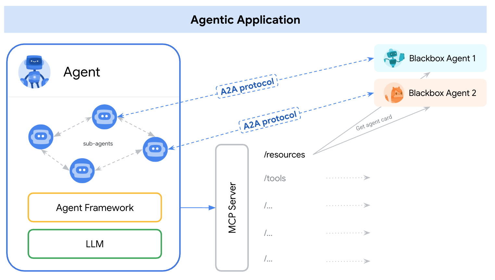

# A2A 和 MCP：详细比较

在 AI 智能体开发中，出现了两种关键的协议类型来促进互操作性。一种将智能体连接到工具和资源。另一种实现智能体间的协作。Agent2Agent（A2A）协议和[模型上下文协议](https://modelcontextprotocol.io/)（MCP）解决了这些不同但高度互补的需求。

## 模型上下文协议（MCP）

模型上下文协议（MCP）定义了 AI 智能体如何与单个工具和资源（如数据库或 API）进行交互和利用。

该协议提供以下能力：

- 标准化 AI 模型和智能体如何连接到工具、API 和其他外部资源并进行交互。
- 定义了一种结构化的方式来描述工具能力，类似于大语言模型中的函数调用。
- 将输入传递给工具并接收结构化输出。
- 支持常见用例，如 LLM 调用外部 API、智能体查询数据库或智能体连接到预定义函数。

## Agent2Agent 协议（A2A）

Agent2Agent 协议专注于使不同的智能体能够相互协作以实现共同目标。

该协议提供以下能力：

- 标准化独立的、通常不透明的 AI 智能体如何作为对等体进行通信和协作。
- 提供应用层协议，供智能体互相发现、协商交互、管理共享任务以及交换对话上下文和复杂数据。
- 支持典型用例，包括客户服务智能体将查询委托给计费智能体，或旅行智能体与航班、酒店和活动智能体协调。

## 为什么需要不同的协议？

MCP 和 A2A 协议对于构建复杂的 AI 系统都是必不可少的，它们解决不同但高度互补的需求。A2A 和 MCP 之间的区别取决于智能体与什么交互。

- **工具和资源（MCP 领域）**：
      - **特征：** 这些通常是具有明确定义的、结构化输入和输出的原语。它们执行特定的、通常是无状态的功能。示例包括计算器、数据库查询 API 或天气查询服务。
      - **目的：** 智能体使用工具来收集信息和执行离散功能。
- **智能体（A2A 领域）**：
      - **特征：** 这些是更自主的系统。它们进行推理、规划、使用多个工具、在更长的交互中维护状态，并参与复杂的、通常是多轮的对话以实现新颖或不断变化的任务。
      - **目的：** 智能体与其他智能体协作以应对更广泛、更复杂的目标。

## A2A ❤️ MCP：智能体系统的互补协议

智能体应用可能主要使用 A2A 与其他智能体通信。每个单独的智能体在内部使用 MCP 与其特定工具和资源进行交互。

{width="80%"}

_智能体应用可能使用 A2A 与其他智能体通信，而每个智能体在内部使用 MCP 与其特定工具和资源进行交互。_

### 示例场景：汽车修理厂

考虑一个由自主 AI 智能体"技师"组成的汽车修理厂。这些技师使用专用工具，如车辆诊断扫描仪、维修手册和举升平台，来诊断和修理问题。修理过程可能涉及广泛的对话、研究以及与零件供应商的交互。

- **客户交互（用户到智能体，使用 A2A）**：客户（或他们的主要助手智能体）使用 A2A 与"店面经理"智能体通信。

    例如，客户可能会说："我的车发出嘎嘎声。"

- **多轮诊断对话（智能体到智能体，使用 A2A）**：店面经理智能体使用 A2A 进行多轮诊断对话。

    例如，经理可能会问："你能发送一下噪音的视频吗？"或"我看到有些液体泄漏。这种情况持续多久了？"

- **内部工具使用（智能体到工具，使用 MCP）**：由店面经理指派任务的技师智能体需要诊断问题。技师智能体使用 MCP 与其专业工具交互。

    例如：

    - MCP 调用"车辆诊断扫描仪"工具：
        `scan_vehicle_for_error_codes(vehicle_id='XYZ123')`
    - MCP 调用"维修手册数据库"工具：
        `get_repair_procedure(error_code='P0300', vehicle_make='Toyota', vehicle_model='Camry')`
    - MCP 调用"举升平台"工具：`raise_platform(height_meters=2)`

- **供应商交互（智能体到智能体，使用 A2A）**：技师智能体确定需要某个特定零件。技师智能体使用 A2A 与"零件供应商"智能体通信以订购零件。
    例如，技师智能体可能会问："你们有 2018 款丰田凯美瑞的 #12345 号零件现货吗？"

- **订单处理（智能体到智能体，使用 A2A）**：零件供应商智能体（也是一个符合 A2A 的系统）响应，可能导致下单。

在这个示例中：

- A2A 促进了客户与修理厂之间、修理厂智能体与外部供应商智能体之间的更高级别、对话式和面向任务的交互。
- MCP 使技师智能体能够使用其特定的结构化工具来执行诊断和修理功能。

A2A 服务器可以将某些技能暴露为 MCP 兼容的资源。然而，A2A 的主要优势在于其支持更灵活、有状态和协作的交互。这些交互超越了典型的工具调用。A2A 专注于智能体在任务上合作，而 MCP 专注于智能体使用能力。

## 将 A2A 智能体表示为 MCP 资源

A2A 服务器（远程智能体）可以将其某些技能暴露为 MCP 兼容的资源，特别是当这些技能定义明确且可以以更类似工具的、无状态的方式调用时。在这种情况下，另一个智能体可能通过 MCP 风格的工具描述（可能源自其智能体卡片）"发现"该 A2A 智能体的特定技能。

然而，A2A 的主要优势在于其支持超越典型工具调用的更灵活、有状态和协作的交互。A2A 是关于智能体在任务上合作，而 MCP 更多是关于智能体使用能力。

通过利用 A2A 进行智能体间协作和 MCP 进行工具集成，开发者可以构建更强大、更灵活和更具互操作性的 AI 系统。
