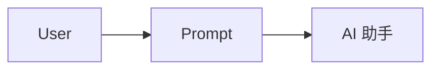
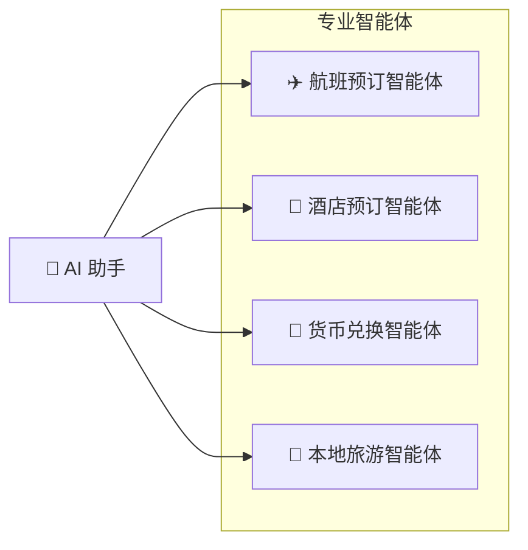
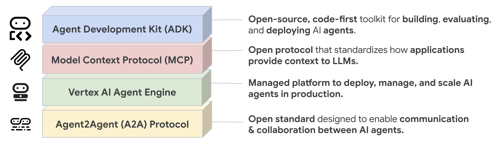
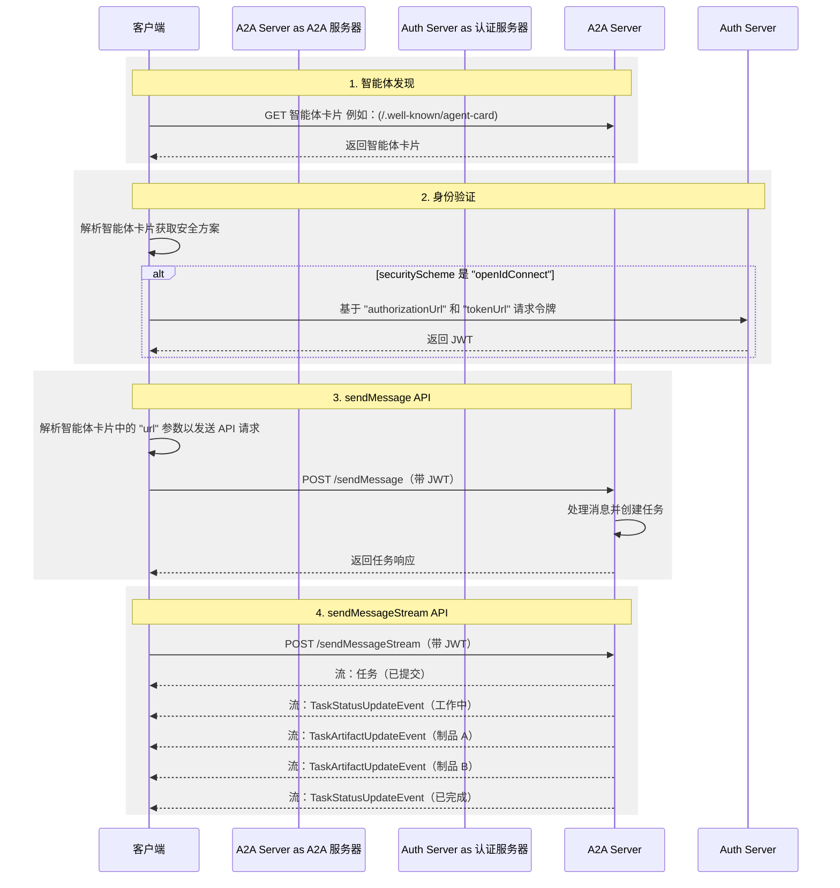

# 什么是 A2A？

A2A 协议是一种开放标准，能够实现 AI 智能体之间的无缝通信和协作。它为使用不同框架、由不同供应商构建的智能体提供了一种通用语言，促进了互操作性并打破了信息孤岛。智能体是在其环境中独立行动的自主问题解决者。A2A 允许来自不同开发者、基于不同框架构建、由不同组织拥有的智能体联合起来协同工作。

## 为什么使用 A2A 协议

A2A 解决了 AI 智能体协作中的关键挑战。它提供了一种标准化的智能体交互方式。本节解释 A2A 解决的问题及其带来的好处。

### A2A 解决的问题

假设用户请求 AI 助手计划一次国际旅行。此任务涉及协调多个专业智能体，例如：

- 航班预订智能体
- 酒店预订智能体
- 本地旅游推荐智能体
- 货币兑换智能体

没有 A2A，整合这些多样化的智能体面临几个挑战：

- **智能体暴露**：开发者通常将智能体包装为工具以暴露给其他智能体，类似于通过模型上下文协议（MCP）暴露工具的方式。然而，这种方法效率低下，因为智能体被设计为直接协商。将智能体包装为工具限制了它们的能力。A2A 允许智能体按原样暴露，无需这种包装。
- **自定义集成**：每次交互都需要自定义的点对点解决方案，带来显著的工程开销。
- **创新缓慢**：为每个新集成进行定制开发会减缓创新。
- **可扩展性问题**：随着智能体和交互数量的增长，系统变得难以扩展和维护。
- **互操作性有限**：这种方法限制了互操作性，阻碍了复杂 AI 生态系统的有机形成。
- **安全漏洞**：临时通信通常缺乏一致的安全措施。

A2A 协议通过建立互操作性来解决这些挑战，使 AI 智能体能够可靠且安全地交互。

### A2A 示例场景

本节提供一个示例场景，说明使用 A2A（Agent2Agent）协议进行复杂 AI 智能体交互的好处。

#### 用户的复杂请求

用户与 AI 助手交互，给出一个复杂的提示，如"计划一次国际旅行。"

#### 协作的需求

AI 助手收到提示，意识到需要调用多个专业智能体来完成请求。这些智能体包括航班预订智能体、酒店预订智能体、货币兑换智能体和本地旅游智能体。

#### 互操作性挑战

核心问题：智能体无法协同工作，因为每个都有其自有的开发和部署方式。

缺乏标准化协议的结果是，这些智能体无法相互协作，更不用说发现彼此能做什么了。各个智能体（航班、酒店、货币和旅游）是孤立的。

#### "有了 A2A"的解决方案

A2A 协议提供了标准的方法和数据结构，使智能体无论其底层实现如何都能相互通信，因此相同的智能体可以作为一个互联系统使用，通过标准化协议无缝通信。

AI 助手现在充当编排者，从所有启用 A2A 的智能体接收整合信息。然后它呈现一个单一的、完整的旅行计划，作为对用户初始提示的无缝响应。

{ width="70%" style="margin:20px auto;display:block;" }

### A2A 的核心优势

实施 A2A 协议在整个 AI 生态系统中提供了显著优势：

- **安全协作**：没有标准，很难确保智能体之间的安全通信。A2A 使用 HTTPS 进行安全通信，并保持操作不透明，因此智能体在协作过程中无法看到其他智能体的内部工作方式。
- **互操作性**：A2A 打破了不同 AI 智能体生态系统之间的壁垒，使来自不同供应商和框架的智能体能够无缝协作。
- **智能体自主性**：A2A 允许智能体保留其各自的能力，并在与其他智能体协作时作为自主实体行动。
- **降低集成复杂性**：该协议标准化了智能体通信，使团队能够专注于其智能体提供的独特价值。
- **支持 LRO**：该协议支持长时间运行操作（LRO）以及使用服务器发送事件（SSE）的流式传输和异步执行。

### A2A 的关键设计原则

A2A 的开发遵循优先考虑广泛采用、企业级能力和面向未来设计的原则。

- **简洁性**：A2A 利用现有标准，如 HTTP、JSON-RPC 和服务器发送事件（SSE）。这避免了重新发明核心技术，加速了开发者的采用。
- **企业就绪**：A2A 满足关键的企业需求。它与标准 Web 实践保持一致，以实现健壮的身份验证、授权、安全、隐私、跟踪和监控。
- **异步优先**：A2A 原生支持长时间运行的任务。它处理智能体或用户可能无法保持持续连接的场景。它使用流式传输和推送通知等机制。
- **模态无关**：该协议允许智能体使用多种内容类型进行通信。这实现了超越纯文本的丰富且灵活的交互。
- **不透明执行**：智能体无需暴露其内部逻辑、记忆或专有工具即可有效协作。交互依赖于声明的能力和交换的上下文。这保护了知识产权并增强了安全性。

### 理解智能体栈：A2A、MCP、智能体框架和模型

A2A 位于更广泛的智能体栈中，其中包括：

- **A2A：** 标准化部署在不同组织、使用不同框架开发的智能体之间的通信。
- **MCP：** 将模型连接到数据和外部资源。
- **框架（如 ADK）：** 提供构建智能体的工具包。
- **模型：** 智能体推理的基础，可以是任何大语言模型（LLM）。

{ width="70%" style="margin:20px auto;display:block;" }

#### A2A 和 MCP

在更广泛的 AI 通信生态系统中，您可能熟悉旨在促进智能体、模型和工具之间交互的协议。值得注意的是，模型上下文协议（MCP）是一种新兴标准，专注于将大语言模型（LLM）与数据和外部资源连接起来。

Agent2Agent（A2A）协议旨在标准化 AI 智能体之间的通信，特别是部署在外部系统中的智能体。A2A 旨在补充 MCP，解决智能体交互中一个不同但相关的方面。

- **MCP 的重点：** 降低将智能体与工具和数据连接起来的复杂性。工具通常是无状态的，执行特定的预定义功能（例如，计算器、数据库查询）。
- **A2A 的重点：** 使智能体能够在其原生模态中协作，允许它们作为智能体（或用户）进行通信，而不是被限制在类似工具的交互中。这实现了复杂的多轮交互，智能体在其中推理、规划并将任务委派给其他智能体。例如，这促进了多轮交互，如在下订单时涉及协商或澄清的交互。

{ width="70%" style="margin:20px auto;display:block;" }

将智能体封装为简单工具的做法从根本上来说是有限制的，因为它无法捕捉智能体的全部能力。这一关键区别在文章[为什么智能体不是工具](https://discuss.google.dev/t/agents-are-not-tools/192812)中有所探讨。

如需更深入的比较，请参考 [A2A 和 MCP 比较](a2a-and-mcp.md)文档。

#### A2A 和 ADK

[Agent Development Kit (ADK)](https://google.github.io/adk-docs) 是 Google 开发的开源智能体开发工具包。A2A 是一种智能体通信协议，支持智能体间通信，无论它们使用什么框架构建（例如，ADK、LangGraph 或 Crew AI）。ADK 是一个灵活且模块化的框架，用于开发和部署 AI 智能体。虽然针对 Gemini AI 和 Google 生态系统进行了优化，但 ADK 是模型无关、部署无关的，并为与其他框架的兼容性而构建。

### A2A 请求生命周期

A2A 请求生命周期是一个序列，详细说明了请求经历的四个主要步骤：智能体发现、身份验证、`sendMessage` API 和 `sendMessageStream` API。下图更深入地展示了操作流程，说明了客户端、A2A 服务器和认证服务器之间的交互。

## 下一步

了解构成 A2A 协议基础的[核心概念](./key-concepts.md)。
