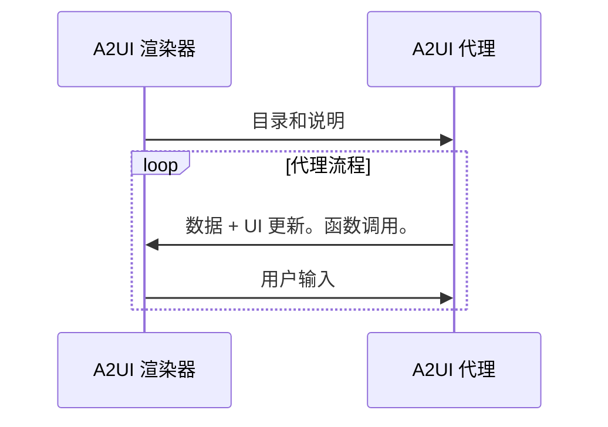
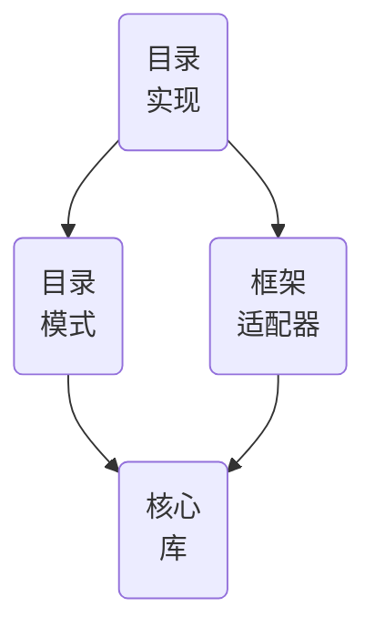

# 词汇表

## A2UI 协议术语

A2UI 协议要求的术语。

### A2UI 代理和 A2UI 渲染器

A2UI 协议支持**代理**和**渲染器**之间的通信：

1. **渲染器**以 A2UI 目录和如何使用它的**说明**的形式提供 **UI 能力**。
2. **代理**在循环中迭代：
    - 提供 **UI** 和可调用的**函数**，同时考虑接收到的目录
    - 接收渲染器传达的**用户输入**
    - 更新要在 UI 中显示的**数据**

虽然该协议是为 **AI 驱动的代理**设计的，但它也可以与确定性代理一起使用。例如，代理可以返回预先准备好的 A2UI UI。

如果代理是无状态的或不保证保留目录，渲染器应在每条消息中提供目录。

有时，代理使用预定义的目录，从而迫使渲染器支持该目录或使用适配器。

### GenUI 组件

允许代理使用的 UI 组件。例如：日期选择器、轮播图、按钮、酒店选择器。

### 目录（Catalog）

1. 渲染器能力的明细：
    - 代理可用于生成 UI 的组件列表
    - 渲染器可调用的函数列表
    - 样式和主题
2. 关于如何使用渲染器能力的说明。

根据用例的不同，目录组件可能或多或少具有领域特定性：

- **不那么特定**：

    基本的 UI 原语，如按钮、标签、行、列、选项选择器等。

- **更特定**：

    像 HotelCheckout 或 FlightSelector 这样的组件。

### 基本目录（Basic Catalog）

由 A2UI 团队维护的目录，用于快速上手 A2UI。

参见[基本目录](../specification/v1_0/catalogs/basic/catalog.json)。

### 表面（Surface）

由 A2UI 代理构建并由 A2UI 渲染器管理的 UI 区域，由多个组件组成。表面不能嵌套。

### 代理架构

A2UI 代理的选项：

- **同进程或服务器端**：

    代理和渲染器可以位于客户端应用程序的同一进程中。例如：桌面版 Flutter 应用程序。

    或者，渲染器可以位于显示 UI 的设备上，代理可以位于另一台设备（服务器）上。

- **编排器代理**：

    中央编排器管理用户和多个专门子代理之间的交互。编排器可以在同一进程中，也可以在服务器上。

- **拉取/推送**：

    代理可以等待来自渲染器的消息/请求，或向其推送消息/请求。

- **有状态/无状态**：

    代理可以保持状态，也可以是无状态的。

- **与其他协议混合**：

    A2UI 可以与其他协议结合使用。例如，代理可以是 MCP 和/或 A2A 服务器。

- **其他**：

    除了上述选项外，还可以有任何自定义变体。

### 渲染器栈

A2UI 渲染器的功能由可以独立开发和重用的层组成：

- **核心库**：

    描述目录和与代理交互所需的一组原语。

    例如，参见 [JavaScript Web 核心库](../../renderers/web_core/README.md)。

- **目录模式**：

    以 JSON 形式表示的目录定义。

    例如，参见[基本目录模式](../specification/v1_0/catalogs/basic/catalog.json)。

- **框架适配器**：

    在具体框架中实现代理指令执行的代码。例如：
    - JavaScript 核心和目录可以适配到 Angular、Electron、React 和 Lit 框架。
    - Dart 核心和目录可以适配到 Flutter 和 Jaspr 框架。

    参见 [Angular 适配器](../../renderers/angular/README.md)。

- **目录实现**：

    针对特定框架的目录模式实现。

    例如：
    - 参见[基本目录的 Angular 实现](../../renderers/angular/src/v0_9/catalog/basic)

### A2UI 消息

代理和渲染器之间的消息。

由于协议支持流式传输，任何消息都可以是已完成的（完全送达）或未完成的（部分送达）。已完成的消息可以是完整的（成功送达）或中断的（因技术问题停止送达）。

参见[数据流指南](data-flow.md)。

### 代理回合（Agent turn）

代理在开始等待用户输入之前发送的一组消息。

### 数据模型（Data model）

可观察的、层次化的、类似 JSON 的对象，在渲染器和代理之间共享，并可由双方更新。每个表面都有独立的数据模型。

组件可以绑定到数据模型的节点，以便在值更改时自动更新。

数据模型支持双向同步，通过将用户交互捕获到状态对象中以传输给代理，同时允许代理将数据更新推送回 UI。

参见[数据绑定指南](data-binding.md)。

### 数据引用（Data reference）

在组件定义中，对数据元素的引用，可以通过数据模型中的路径解析，也可以通过值解析。

参见[基本目录中的示例](../specification/v1_0/catalogs/basic/catalog.json#L18)。

### 客户端函数（Client function）

提供给代理在需要时调用的函数。

不要与 LLM 工具混淆：

| 特性        | 客户端函数                                                       | LLM 工具调用                                                                   |
| ---------- | ---------------------------------------------------------------- | ------------------------------------------------------------------------------ |
| 执行者      | A2UI 渲染器                                                      | LLM 请求调用，不关心执行细节。                                                  |
| 时机        | 在代理到渲染器的消息发送之后。                                     | 在代理到渲染器的消息发送之前。                                                  |
| 目的        | UI 逻辑（验证、可见切换、格式化）                                  | 推理、数据获取、后端操作                                                        |
| 定义        | 在客户端函数注册表中注册，并在目录中声明                             | 在 ToolDefinition 中定义（传递给 LLM）                                          |
| 状态访问    | 可访问 DataContext 和输入值。                                     | 无法访问。可访问外部 API、数据库和服务。                                         |

参见[常见类型中的示例](../specification/v0_9/json/common_types.json#L200)。

### 操作（Action）

用户在 UI 中触发的交互的容器。操作分为两种类型：

- **事件（Event）**：发送到代理进行处理（例如，点击"提交"）。
- **函数（Function）**：在渲染器上本地执行（例如，打开 URL）。

参见[操作详细指南](actions.md)。

## 生成式 UI 术语

A2UI 协议不要求但常用于生成式 UI 上下文中的术语。

### GenUI 的常见模式

- **聊天**：

    生成的 UI 片段按时间顺序逐个出现，在垂直可滚动区域中与用户输入混合排列。

- **画布**：

    与代理协作的空间。

- **仪表盘**：

    生成的 UI 片段不按时间排序，而是按含义组织，并可靠地（即固定）停留在用户期望看到的位置。

- **向导**：

    生成的 UI 片段逐个显示，目的是为特定任务收集必要的信息。

### NoAI 信息

归类为**AI 不可访问**的信息（例如，信用卡信息）。

哪些信息不应被 AI 访问由应用所有者定义，且在不同**上下文**中是不同的。例如，在某些上下文中，医疗记录绝不应被 AI 获取，而在其他上下文中，AI 被大量用于辅助医疗诊断，因此需要医疗记录。

这个术语在 GenUI 上下文中很重要，因为最终用户希望**清楚地看到**他们的输入哪些允许传递给 AI，哪些不允许。
