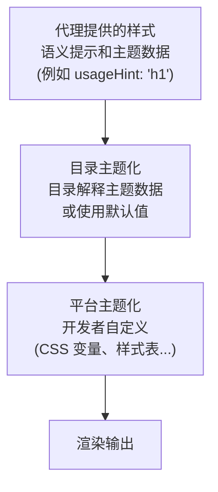

# 主题化和样式

自定义 A2UI 组件的外观和感觉以匹配你的品牌。

## A2UI 样式理念

A2UI 默认采用**渲染器控制样式**的方法，但通过目录提供灵活性：

- **代理描述要显示的内容**（组件和结构）
- **渲染器决定外观**（颜色、字体、间距）

然而，协议足够灵活，允许代理在需要时影响样式。

## 样式层

A2UI 样式在多层中工作：



## 代理提供的样式信息

### 语义提示

代理提供语义提示（而非视觉样式）来指导渲染。在_基本目录_中：

```json
{
  "id": "title",
  "component": {
    "Text": {
      "text": {"literalString": "欢迎"},
      "usageHint": "h1"
    }
  }
}
```

**常见的 `usageHint` 值：**

- 文本：`h1`、`h2`、`h3`、`h4`、`h5`、`body`、`caption`
- 其他组件有其自己的提示（参见[组件参考](../reference/components.md)）

目录元素将这些语义提示映射到目标平台上的实际组件并进行样式化。

### `theme` 属性

A2UI 协议允许在 `createSurface` 消息中使用任意的 `theme` 属性。目前，此属性在 Zod 模式中定义为 `z.any().optional()`，意味着代理可以传递客户端渲染器和目录能理解的任何 JSON 结构。

- 查看 [server-to-client.ts](../../renderers/web_core/src/v0_9/schema/server-to-client.ts) 中的模式定义。
- 查看 [catalog/types.ts](../../renderers/web_core/src/v0_9/catalog/types.ts) 中的 `Catalog` 类和 `themeSchema`。

**注意：** _基本_目录中的组件未配置为使用来自代理的 `theme`。

_想影响这个设计？在这里发表意见：[#1118](https://github.com/a2ui-project/a2ui/issues/1118)。_

## 目录主题化

主题化是目录实现的责任。每个目录可以提供它想要的任何主题化解决方案。作为示例，以下是默认的_基本目录_的做法：

### Web 基本目录主题化

在 Web 上，默认 A2UI 渲染器提供的_基本目录_通过覆盖 CSS 变量来设置主题。

基本目录组件注入一个小的样式表，其中包含这些变量的默认值。样式表针对 `:where(:root)`，因此其特异性最小，宿主应用可以轻松覆盖它们。

例如，要覆盖主要颜色，你可以简单地将以下内容添加到应用的 CSS 中：

```css
:root {
  --a2ui-color-primary: #ff5722;
}
```

查看 [default.ts](../../renderers/web_core/src/v0_9/basic_catalog/styles/default.ts) 中的默认样式。

**查看每个平台的示例：**

- [Lit 示例](../../samples/client/lit)
- [Angular 示例](../../samples/client/angular)
- [React 示例](../../samples/client/react)

### 每个组件的覆盖

除了全局主题化，_基本目录_的每个组件都暴露了自定义变量以进一步细化其外观。例如，`Card` 组件暴露了 `--a2ui-card-background` 变量。

查看每个组件的文档以了解它暴露了哪些变量。

## 常见样式功能

### 暗色模式

默认的 Web 渲染器支持基于系统偏好的自动暗色模式（`prefers-color-scheme`）。

要始终强制暗色或浅色模式（或以编程方式控制切换），在生成的代码的祖先元素上使用 `a2ui-light` 或 `a2ui-dark` 类名。

### 自定义字体

字体可以像在任何其他 Web 应用中一样加载。_基本目录_组件尝试继承其容器的字体系列，但提供两个可覆盖的值：`--a2ui-font-family-title` 和 `--a2ui-font-family-monospace`，用于为标题和等宽文本块设置不同的字体。

## Flutter

Flutter 具有内置的主题支持。参见：

- [使用主题共享颜色和字体样式](https://docs.flutter.dev/cookbook/design/themes) 来自 Flutter 文档。

## 最佳实践

### 1. 使用语义提示，而非视觉属性

定义组件时，代理应提供语义提示（`usageHint`），而非视觉样式：

```json
// ✅ 好：语义提示
{
  "component": {
    "Text": {
      "text": {"literalString": "欢迎"},
      "usageHint": "h1"
    }
  }
}

// ❌ 不好：视觉属性（不支持）
{
  "component": {
    "Text": {
      "text": {"literalString": "欢迎"},
      "fontSize": 24,
      "color": "#FF0000"
    }
  }
}
```

### 2. 保持无障碍性

- 确保足够的颜色对比度（WCAG AA：普通文本 4.5:1，大文本 3:1）
- 使用屏幕阅读器测试
- 支持键盘导航
- 在浅色和暗色模式下测试

### 3. 使用设计令牌

定义可重复使用的设计令牌（颜色、间距等），并在整个样式中引用它们以保持一致性。

### 4. 跨平台测试

- 在所有目标平台（Web、移动端、桌面端）上测试你的主题化
- 验证浅色和暗色模式
- 检查不同的屏幕尺寸和方向
- 确保跨平台一致品牌体验

## 下一步

- **[定义自己的目录](defining-your-own-catalog.md)**：使用你的样式构建自定义组件
- **[组件参考](../reference/components.md)**：查看所有组件的样式选项
- **[客户端设置](client-setup.md)**：在你的应用中设置渲染器
